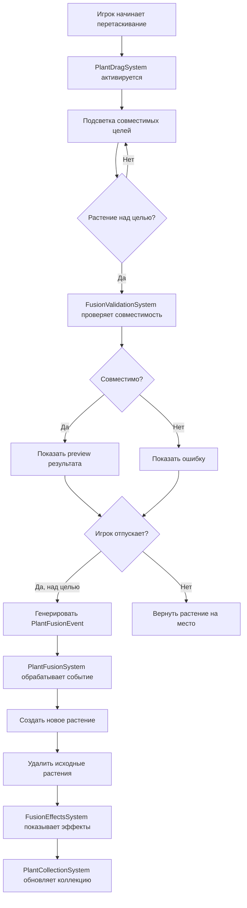
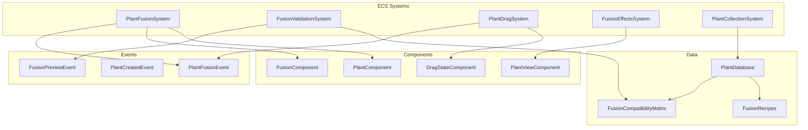

# Документ проектирования системы растений с объединением

## Обзор

Система растений с объединением (Plant Fusion System) представляет собой модульную архитектуру для Unity ECS, которая позволяет создавать, управлять и объединять растения в tower defense игре. Система основана на компонентно-ориентированном подходе с использованием DragonECS и интегрируется с существующим Bootstrap.

Ключевые особенности:
- Базовые растения с настраиваемыми характеристиками
- Система объединения одинаковых растений (улучшение уровня)
- Система гибридизации разных типов растений
- Визуальная обратная связь для drag-and-drop операций
- Система прогрессии и коллекции растений
- Справочник растений с рецептами

## Архитектура

### Компонентная архитектура ECS

#### Анализ существующих компонентов

Существующие компоненты в проекте:
- `TransformReference` - ссылка на Transform
- `RendererReference` - ссылка на Renderer
- `Health` - здоровье (CurrentHealth, MaxHealth)
- `MoveSpeed` - скорость движения
- `Damage` - урон
- `Plant` - тег растения
- `AttackCooldown` - кулдаун атаки (Rate, Timer)
- `AttackRange` - дальность атаки
- `ProjectilePrefab` - префаб снаряда
- `SunProducer` - производитель солнца (ProductionRate, Timer, SunAmount)
- `GridCoordinates` - координаты на сетке
- `Target` - цель атаки
- `PlayerData` - данные игрока (SunAmount, CurrentWaveIndex)

#### Новые компоненты для системы объединения

```csharp
// Расширение существующего Plant компонента
[Serializable]
public struct PlantIdentity : IEcsComponent
{
    public PlantType Type;
    public int Level;
    public bool IsHybrid;
    public PlantType ParentType1; // Для гибридов
    public PlantType ParentType2; // Для гибридов
    public string DisplayName;
}
public class PlantIdentityTemplate : ComponentTemplate<PlantIdentity> {}

// Данные для системы объединения
[Serializable]
public struct FusionData : IEcsComponent
{
    public bool CanFuse;
    public int MaxLevel;
    public float FusionExperience; // Опыт для улучшения
    public float ExperienceToNextLevel;
    public bool IsCompatibleWithSameType;
    public bool IsCompatibleWithDifferentTypes;
}
public class FusionDataTemplate : ComponentTemplate<FusionData> {}

// Состояние перетаскивания
[Serializable]
public struct DragState : IEcsComponent
{
    public bool IsDragging;
    public bool IsBeingDraggedOver; // Другое растение тащат на это
    public Vector3 OriginalPosition;
    public Vector3 CurrentPosition;
    public int OriginalGridIndex;
    public float DragStartTime;
}
public class DragStateTemplate : ComponentTemplate<DragState> {}

// Состояние анимации
[Serializable]
public struct AnimationState : IEcsComponent
{
    public PlantAnimationState CurrentState;
    public PlantAnimationState PreviousState;
    public float StateTime;
    public bool IsTransitioning;
}
public class AnimationStateTemplate : ComponentTemplate<AnimationState> {}

// Эффекты и статусы
[Serializable]
public struct PlantStatus : IEcsComponent
{
    public bool IsFrozen;
    public bool IsPoisoned;
    public bool IsShielded;
    public bool IsEnraged;
    public float FreezeTime;
    public float PoisonTime;
    public float ShieldTime;
    public float EnrageTime;
}
public class PlantStatusTemplate : ComponentTemplate<PlantStatus> {}

// Компонент для предварительного просмотра объединения
[Serializable]
public struct FusionPreview : IEcsComponent
{
    public bool IsActive;
    public PlantType PreviewType;
    public int PreviewLevel;
    public GameObject PreviewGameObject;
    public float PreviewAlpha;
}
public class FusionPreviewTemplate : ComponentTemplate<FusionPreview> {}

// Способности растения
[Serializable]
public struct PlantAbilities : IEcsComponent
{
    public PlantAbility PrimaryAbility;
    public PlantAbility SecondaryAbility;
    public PlantAbility PassiveAbility;
    public bool HasSpecialAttack;
    public float SpecialAttackCooldown;
}
public class PlantAbilitiesTemplate : ComponentTemplate<PlantAbilities> {}

// Экономические данные (расширение существующих)
[Serializable]
public struct PlantEconomy : IEcsComponent
{
    public int PurchaseCost;
    public int FusionCost;
    public int SellValue;
}
public class PlantEconomyTemplate : ComponentTemplate<PlantEconomy> {}

// Совместимость для объединения
[Serializable]
public struct FusionCompatibility : IEcsComponent
{
    public PlantType[] CompatibleTypes;
    public int CompatibleTypesCount;
}
public class FusionCompatibilityTemplate : ComponentTemplate<FusionCompatibility> {}
```

#### Дополнительные структуры данных

```csharp
// Совместимость для объединения
[Serializable]
public struct FusionCompatibility
{
    public PlantType[] CompatibleTypes;
    public FusionRule[] SpecialRules;
    public bool CanFuseWithSameType;
    public bool CanFuseWithDifferentTypes;
}

// Правила объединения
[Serializable]
public struct FusionRule
{
    public PlantType RequiredType;
    public int MinLevel;
    public int MaxLevel;
    public bool RequiresSpecialCondition;
    public string ConditionDescription;
}

// Состояния анимации
public enum PlantAnimationState
{
    Idle,
    Attack,
    Damaged,
    Fusion,
    Death,
    Special,
    Produce, // Для подсолнухов
    Eating   // Для хомяков
}

// Типы снарядов
public enum ProjectileType
{
    Pea,
    FrozenPea,
    Fireball,
    Spore,
    Thorn,
    Energy
}

// Способность растения (расширенная версия)
[Serializable]
public struct PlantAbility
{
    public PlantAbilityType Type;
    public float Value;
    public float Cooldown;
    public float Duration;
    public float Range;
    public string Name;
    public string Description;
    public Sprite Icon;
    public bool IsActive;
    public AbilityTarget TargetType;
    public GameObject EffectPrefab;
}

// Цель способности
public enum AbilityTarget
{
    Self,
    SingleEnemy,
    MultipleEnemies,
    AllEnemies,
    Area,
    Allies,
    Ground
}
```

#### События системы

```csharp
// Основное событие объединения растений
public struct PlantFusionEvent : IEcsEvent
{
    public int SourceEntity;
    public int TargetEntity;
    public FusionType Type;
    public Vector3 FusionPosition;
    public float FusionDelay; // Задержка для анимации
}

// Событие создания нового растения
public struct PlantCreatedEvent : IEcsEvent
{
    public int Entity;
    public PlantType Type;
    public int Level;
    public Vector3 Position;
    public int GridIndex;
    public bool IsNewDiscovery;
    public bool IsFromFusion;
}

// Событие предварительного просмотра объединения
public struct FusionPreviewEvent : IEcsEvent
{
    public int SourceEntity;
    public int TargetEntity;
    public PlantData PreviewResult;
    public bool IsValid;
    public FusionError Error;
    public Vector3 PreviewPosition;
}

// Событие начала перетаскивания
public struct PlantDragStartEvent : IEcsEvent
{
    public int Entity;
    public Vector3 StartPosition;
    public int StartGridIndex;
    public Vector3 MousePosition;
}

// Событие окончания перетаскивания
public struct PlantDragEndEvent : IEcsEvent
{
    public int Entity;
    public Vector3 EndPosition;
    public int EndGridIndex;
    public bool WasSuccessful;
    public int TargetEntity; // Если было объединение
}

// Событие обновления предварительного просмотра
public struct FusionPreviewUpdateEvent : IEcsEvent
{
    public int SourceEntity;
    public int HoveredEntity;
    public bool ShowPreview;
    public PlantStats PreviewStats;
}

// Событие открытия нового рецепта
public struct RecipeDiscoveredEvent : IEcsEvent
{
    public PlantType NewPlantType;
    public PlantType Parent1;
    public PlantType Parent2;
    public string RecipeName;
    public bool ShowNotification;
}

// Событие изменения характеристик растения
public struct PlantStatsChangedEvent : IEcsEvent
{
    public int Entity;
    public PlantStats OldStats;
    public PlantStats NewStats;
    public StatChangeReason Reason;
}

// Событие активации способности растения
public struct PlantAbilityActivatedEvent : IEcsEvent
{
    public int Entity;
    public PlantAbilityType AbilityType;
    public Vector3 TargetPosition;
    public int TargetEntity;
    public float Duration;
}

// Событие получения опыта растением
public struct PlantExperienceGainedEvent : IEcsEvent
{
    public int Entity;
    public float ExperienceGained;
    public float TotalExperience;
    public bool LeveledUp;
    public int NewLevel;
}

// Событие валидации позиции при перетаскивании
public struct DragValidationEvent : IEcsEvent
{
    public int Entity;
    public Vector3 Position;
    public int GridIndex;
    public bool IsValidPosition;
    public bool CanFuseWithTarget;
    public int PotentialTarget;
}

// Дополнительные перечисления
public enum StatChangeReason
{
    Fusion,
    LevelUp,
    Buff,
    Debuff,
    Equipment,
    Temporary
}
```

### Системы ECS

#### 1. PlantFusionSystem
Основная система обработки объединения растений:
- Обрабатывает PlantFusionEvent
- Проверяет совместимость растений
- Выполняет логику объединения
- Создает новые растения с улучшенными характеристиками

#### 2. FusionValidationSystem
Система валидации возможности объединения:
- Проверяет типы растений
- Проверяет уровни растений
- Проверяет таблицу совместимости
- Генерирует FusionPreviewEvent

#### 3. PlantDragSystem
Система обработки перетаскивания:
- Обрабатывает input для drag-and-drop
- Управляет состоянием DragStateComponent
- Подсвечивает совместимые цели
- Генерирует события объединения

#### 4. FusionEffectsSystem
Система визуальных эффектов:
- Воспроизводит анимации объединения
- Управляет particle effects
- Показывает preview результата
- Обрабатывает UI feedback

#### 5. PlantCollectionSystem
Система управления коллекцией:
- Отслеживает открытые растения
- Сохраняет/загружает прогресс
- Управляет рецептами гибридов
- Обрабатывает новые открытия

## ScriptableEntityTemplate для растений

### PlantEntityTemplate
Базовый шаблон для всех растений, наследующий от RequiredEntityTemplate:

```csharp
[CreateAssetMenu(fileName = "PlantEntityTemplate", menuName = "TowerDefense/Plant Entity Template")]
public class PlantEntityTemplate : RequiredEntityTemplate
{
    [Header("Plant Configuration")]
    public PlantConfig PlantConfig;
    
    protected override IEnumerable<IComponentTemplate> GetRequiredComponents()
    {
        return new IComponentTemplate[]
        {
            // Базовые компоненты
            new TransformReferenceTemplate(),
            new RendererReferenceTemplate(),
            new PlantTemplate(), // Тег растения
            
            // Характеристики
            new HealthTemplate(),
            new DamageTemplate(),
            new AttackCooldownTemplate(),
            new AttackRangeTemplate(),
            
            // Позиционирование
            new GridCoordinatesTemplate(),
            
            // Новые компоненты для системы объединения
            new PlantIdentityTemplate(),
            new FusionDataTemplate(),
            new PlantAbilitiesTemplate(),
            new PlantEconomyTemplate(),
            new FusionCompatibilityTemplate(),
            new AnimationStateTemplate(),
            new PlantStatusTemplate(),
            
            // Опциональные компоненты (добавляются по условию)
            GetOptionalComponents()
        }.Where(c => c != null);
    }
    
    protected virtual IComponentTemplate[] GetOptionalComponents()
    {
        var optional = new List<IComponentTemplate>();
        
        // Добавляем SunProducer только для подсолнухов
        if (PlantConfig != null && PlantConfig.Name.Contains("Sunflower"))
        {
            optional.Add(new SunProducerTemplate());
        }
        
        // Добавляем ProjectilePrefab только для стреляющих растений
        if (PlantConfig != null && IsShootingPlant(PlantConfig))
        {
            optional.Add(new ProjectilePrefabTemplate());
        }
        
        return optional.ToArray();
    }
    
    private bool IsShootingPlant(PlantConfig config)
    {
        return config.Name.Contains("Peashooter") || 
               config.Name.Contains("Repeater") ||
               config.Name.Contains("Snow");
    }
    
    public override void OnValidate()
    {
        base.OnValidate();
        
        if (PlantConfig != null)
        {
            // Автоматически настраиваем компоненты на основе PlantConfig
            ConfigureFromPlantConfig();
        }
    }
    
    private void ConfigureFromPlantConfig()
    {
        // Настройка PlantIdentity
        var identity = Get<PlantIdentity>();
        identity.DisplayName = PlantConfig.Name;
        identity.Level = 1;
        identity.IsHybrid = false;
        
        // Настройка PlantEconomy
        var economy = Get<PlantEconomy>();
        economy.PurchaseCost = PlantConfig.Cost;
        economy.FusionCost = PlantConfig.Cost / 2;
        economy.SellValue = PlantConfig.Cost / 4;
        
        // Настройка базовых характеристик
        var health = Get<Health>();
        health.MaxHealth = GetBaseHealthForPlant(PlantConfig.Name);
        health.CurrentHeath = health.MaxHealth;
        
        var damage = Get<Damage>();
        damage.Value = GetBaseDamageForPlant(PlantConfig.Name);
        
        var attackCooldown = Get<AttackCooldown>();
        attackCooldown.Rate = GetBaseAttackRateForPlant(PlantConfig.Name);
        
        var attackRange = Get<AttackRange>();
        attackRange.Value = GetBaseRangeForPlant(PlantConfig.Name);
    }
    
    private int GetBaseHealthForPlant(string plantName)
    {
        return plantName switch
        {
            var name when name.Contains("WallNut") => 300,
            var name when name.Contains("Sunflower") => 100,
            var name when name.Contains("Peashooter") => 150,
            var name when name.Contains("Repeater") => 150,
            var name when name.Contains("Snow") => 150,
            var name when name.Contains("Chomper") => 200,
            _ => 100
        };
    }
    
    private int GetBaseDamageForPlant(string plantName)
    {
        return plantName switch
        {
            var name when name.Contains("Peashooter") => 20,
            var name when name.Contains("Repeater") => 20,
            var name when name.Contains("Snow") => 20,
            var name when name.Contains("Chomper") => 100,
            var name when name.Contains("CherryBomb") => 200,
            _ => 0
        };
    }
    
    private float GetBaseAttackRateForPlant(string plantName)
    {
        return plantName switch
        {
            var name when name.Contains("Peashooter") => 1.5f,
            var name when name.Contains("Repeater") => 1.5f,
            var name when name.Contains("Snow") => 1.5f,
            var name when name.Contains("Chomper") => 3.0f,
            var name when name.Contains("Sunflower") => 0f, // Не атакует
            _ => 2.0f
        };
    }
    
    private int GetBaseRangeForPlant(string plantName)
    {
        return plantName switch
        {
            var name when name.Contains("Peashooter") => 5,
            var name when name.Contains("Repeater") => 5,
            var name when name.Contains("Snow") => 5,
            var name when name.Contains("Chomper") => 1,
            var name when name.Contains("CherryBomb") => 1,
            _ => 0
        };
    }
}
```

### Специализированные шаблоны растений

```csharp
// Шаблон для гибридных растений
[CreateAssetMenu(fileName = "HybridPlantTemplate", menuName = "TowerDefense/Hybrid Plant Template")]
public class HybridPlantEntityTemplate : PlantEntityTemplate
{
    [Header("Hybrid Configuration")]
    public PlantType ParentType1;
    public PlantType ParentType2;
    public FusionFormula FusionFormula;
    
    protected override IComponentTemplate[] GetOptionalComponents()
    {
        var baseOptional = base.GetOptionalComponents().ToList();
        
        // Гибриды могут иметь дополнительные способности
        baseOptional.Add(new PlantStatusTemplate());
        
        return baseOptional.ToArray();
    }
    
    private void ConfigureAsHybrid()
    {
        var identity = Get<PlantIdentity>();
        identity.IsHybrid = true;
        identity.ParentType1 = ParentType1;
        identity.ParentType2 = ParentType2;
        
        // Применяем формулу объединения к характеристикам
        ApplyFusionFormula();
    }
    
    private void ApplyFusionFormula()
    {
        if (FusionFormula.HealthMultiplier > 0)
        {
            var health = Get<Health>();
            health.MaxHealth = Mathf.RoundToInt(health.MaxHealth * FusionFormula.HealthMultiplier);
            health.CurrentHeath = health.MaxHealth;
        }
        
        if (FusionFormula.DamageMultiplier > 0)
        {
            var damage = Get<Damage>();
            damage.Value = Mathf.RoundToInt(damage.Value * FusionFormula.DamageMultiplier);
        }
        
        if (FusionFormula.AttackSpeedMultiplier > 0)
        {
            var attackCooldown = Get<AttackCooldown>();
            attackCooldown.Rate = attackCooldown.Rate / FusionFormula.AttackSpeedMultiplier;
        }
        
        if (FusionFormula.RangeMultiplier > 0)
        {
            var attackRange = Get<AttackRange>();
            attackRange.Value = Mathf.RoundToInt(attackRange.Value * FusionFormula.RangeMultiplier);
        }
    }
}
```

## Компоненты и интерфейсы

### Структуры данных

#### PlantData
```csharp
[Serializable]
public struct PlantData
{
    public PlantType Type;
    public string Name;
    public string Description;
    public Sprite Icon;
    public GameObject Prefab;
    public PlantStats BaseStats;
    public PlantStats[] LevelStats; // Статы для каждого уровня
    public PlantAbility[] Abilities;
}

[Serializable]
public struct PlantStats
{
    public float Health;
    public float Damage;
    public float AttackSpeed;
    public float Range;
    public int Cost;
}
```

#### FusionRecipe
```csharp
[Serializable]
public struct FusionRecipe
{
    public PlantType Parent1;
    public PlantType Parent2;
    public PlantType Result;
    public string RecipeName;
    public bool IsDiscovered;
    public FusionFormula Formula;
}

[Serializable]
public struct FusionFormula
{
    public float HealthMultiplier;
    public float DamageMultiplier;
    public float AttackSpeedMultiplier;
    public float RangeMultiplier;
    public PlantAbility[] InheritedAbilities;
    public PlantAbility[] NewAbilities;
}
```

### Конфигурационные ScriptableObjects

#### PlantDatabase
```csharp
[CreateAssetMenu(fileName = "PlantDatabase", menuName = "TowerDefense/Plant Database")]
public class PlantDatabase : ScriptableObject
{
    [SerializeField] private PlantData[] _plants;
    [SerializeField] private FusionRecipe[] _fusionRecipes;
    [SerializeField] private FusionCompatibilityMatrix _compatibilityMatrix;
    
    public PlantData GetPlant(PlantType type) { /* ... */ }
    public FusionRecipe[] GetRecipesForPlant(PlantType type) { /* ... */ }
    public bool AreCompatible(PlantType type1, PlantType type2) { /* ... */ }
}
```

#### FusionCompatibilityMatrix
```csharp
[Serializable]
public class FusionCompatibilityMatrix
{
    [SerializeField] private FusionCompatibilityEntry[] _entries;
    
    public bool AreCompatible(PlantType type1, PlantType type2)
    {
        return _entries.Any(e => 
            (e.Type1 == type1 && e.Type2 == type2) || 
            (e.Type1 == type2 && e.Type2 == type1));
    }
}

[Serializable]
public struct FusionCompatibilityEntry
{
    public PlantType Type1;
    public PlantType Type2;
    public bool IsCompatible;
}
```

## Модели данных

### Перечисления

```csharp
public enum PlantType
{
    // Базовые растения
    Peashooter,
    Sunflower,
    WallNut,
    CherryBomb,
    PotatoMine,
    SnowPea,
    Chomper,
    Repeater,
    
    // Гибридные растения (примеры)
    IcePeashooter,    // SnowPea + Peashooter
    SunShooter,       // Sunflower + Peashooter
    ExplodingWallNut, // WallNut + CherryBomb
    FrostChomper,     // Chomper + SnowPea
    
    // Улучшенные версии
    Peashooter_Level2,
    Peashooter_Level3,
    Sunflower_Level2,
    // ... и так далее
}

public enum FusionType
{
    SameType,    // Объединение одинаковых растений
    Hybrid,      // Создание гибрида
    Invalid      // Невозможное объединение
}

public enum PlantAbilityType
{
    Shoot,
    ProduceSun,
    Block,
    Explode,
    Freeze,
    Eat,
    Slow,
    Poison,
    Heal,
    Shield
}
```

### Способности растений

```csharp
[Serializable]
public struct PlantAbility
{
    public PlantAbilityType Type;
    public float Value;
    public float Cooldown;
    public float Duration;
    public string Description;
}
```

## Обработка ошибок

### Валидация объединения
- Проверка существования растений
- Проверка совместимости типов
- Проверка максимального уровня
- Проверка доступности ресурсов

### Обработка исключений
```csharp
public enum FusionError
{
    None,
    IncompatibleTypes,
    MaxLevelReached,
    InsufficientResources,
    InvalidPlantState,
    RecipeNotFound
}

public struct FusionResult
{
    public bool Success;
    public FusionError Error;
    public PlantData ResultPlant;
    public string ErrorMessage;
}
```

## Стратегия тестирования

### Unit тесты
1. **PlantFusionLogic тесты**
   - Тестирование формул объединения
   - Проверка совместимости растений
   - Валидация результатов гибридизации

2. **FusionValidation тесты**
   - Тестирование правил объединения
   - Проверка ограничений уровня
   - Валидация входных данных

3. **PlantCollection тесты**
   - Тестирование сохранения/загрузки
   - Проверка открытия новых рецептов
   - Валидация состояния коллекции

### Integration тесты
1. **ECS Systems тесты**
   - Тестирование взаимодействия систем
   - Проверка обработки событий
   - Валидация жизненного цикла компонентов

2. **UI Integration тесты**
   - Тестирование drag-and-drop
   - Проверка визуальной обратной связи
   - Валидация пользовательского интерфейса

### Диаграммы

#### Диаграмма потока объединения растений



#### Архитектурная диаграмма системы



Система интегрируется с существующим Bootstrap через добавление новых систем в pipeline и регистрацию событий через AddCaller.