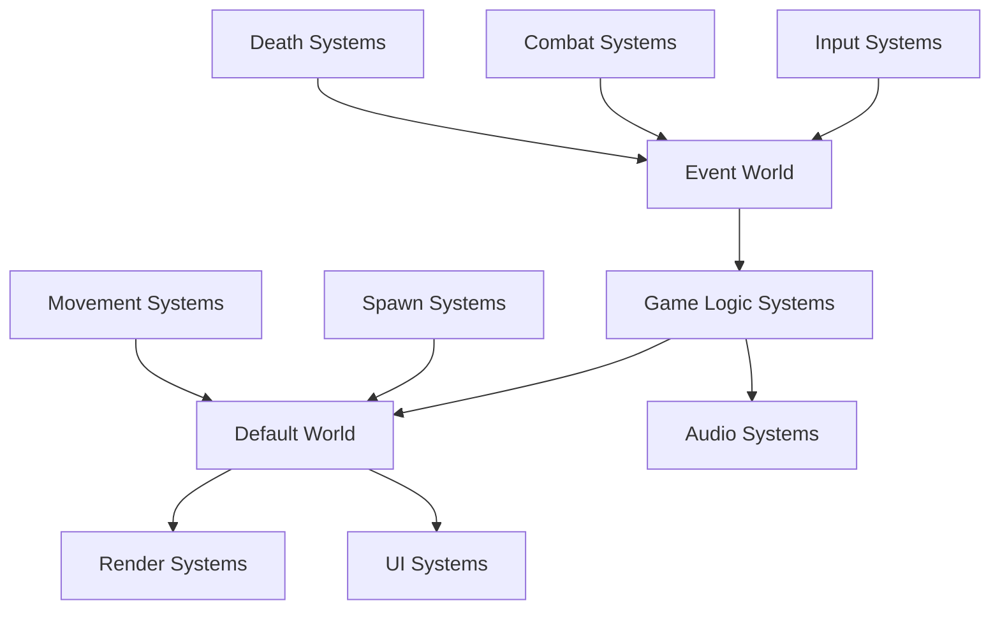
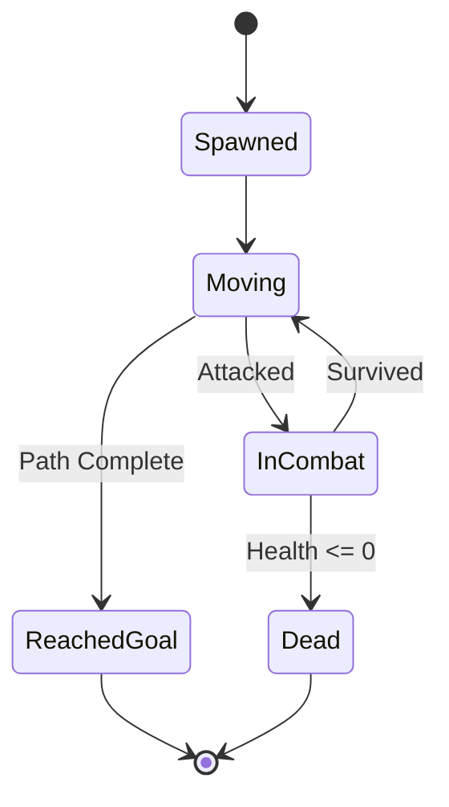
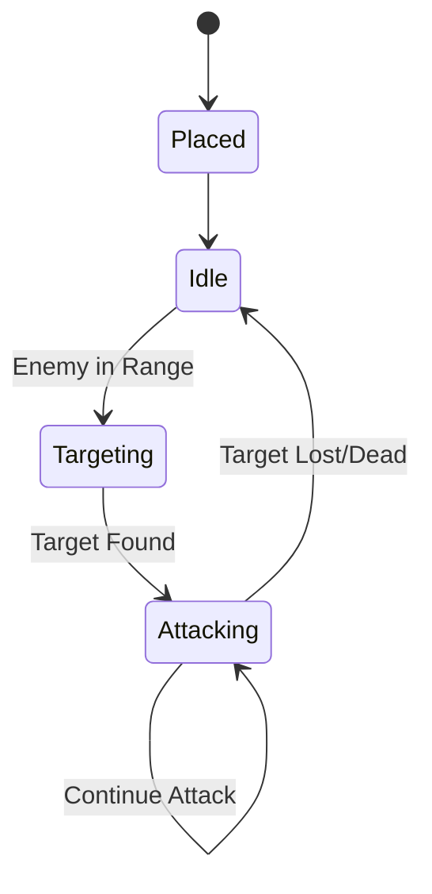

# Документ дизайна

## Обзор

Plants vs Zombies Tower Defence игра, построенная на Unity с использованием DragonECS. Игрок размещает растения на газоне для защиты дома от волн зомби. Игра использует Entity-Component-System архитектуру для эффективного управления растениями, зомби и игровой логикой.

## Архитектура

### ECS Структура
- **Entities**: Игровые объекты (растения, зомби, снаряды, солнце, UI элементы)
- **Components**: Данные объектов (позиция, здоровье, урон, скорость, тип растения/зомби)
- **Systems**: Логика игры (движение зомби, атака растений, генерация солнца, UI)

### Основные миры (Worlds)
- **EcsDefaultWorld**: Основной игровой мир для всех игровых объектов
- **EcsEventWorld**: Мир для событий (атака, смерть, размещение растения, сбор солнца)

## Компоненты и интерфейсы

### Базовые компоненты
```csharp
// Позиция на сетке
public struct GridPosition : IEcsComponent
{
    public int X;
    public int Y;
}

// Мировая позиция
public struct WorldPosition : IEcsComponent
{
    public Vector3 Position;
}

// Здоровье
public struct Health : IEcsComponent
{
    public float Current;
    public float Max;
}

// Урон
public struct Damage : IEcsComponent
{
    public float Value;
}

// Скорость
public struct Speed : IEcsComponent
{
    public float Value;
}
```

### Компоненты растений
```csharp
// Маркер растения
public struct Plant : IEcsComponent { }

// Характеристики атаки растения (только для атакующих растений)
public struct PlantAttack : IEcsComponent
{
    public float AttackSpeed;
    public float LastAttackTime;
    public int TargetLane; // Дорожка для атаки (-1 = вся дорожка)
}

// Генерация солнца (только для солнце-генерирующих растений)
public struct SunGenerator : IEcsComponent
{
    public int SunAmount;
    public float LastGenerationTime;
    public float GenerationInterval;
}

// Тип растения (ссылка на шаблон)
public struct PlantType : IEcsComponent
{
    public ScriptableEntityTemplate Template;
    public string PlantName;
}

// Стоимость растения в солнце
public struct PlantCost : IEcsComponent
{
    public int SunCost;
}

// Защитное растение (например, орех-стена)
public struct DefensivePlant : IEcsComponent
{
    public float MaxHealth;
    public float CurrentHealth;
}
```

### Компоненты зомби
```csharp
// Маркер зомби
public struct Zombie : IEcsComponent { }

// Дорожка движения зомби
public struct ZombieLane : IEcsComponent
{
    public int LaneIndex;
    public float TargetX; // Позиция дома на дорожке
}

// Тип зомби (ссылка на шаблон)
public struct ZombieType : IEcsComponent
{
    public ScriptableEntityTemplate Template;
    public string ZombieName;
}

// Награда за убийство (солнце)
public struct ZombieReward : IEcsComponent
{
    public int SunReward;
}

// Особые способности зомби
public struct ZombieAbility : IEcsComponent
{
    public ZombieAbilityType AbilityType;
    public float AbilityValue;
}

public enum ZombieAbilityType
{
    None,
    Jump,      // Перепрыгивает первое растение
    Armor,     // Дополнительная защита
    Speed      // Увеличенная скорость
}
```

### Компоненты снарядов и солнца
```csharp
// Маркер снаряда
public struct Projectile : IEcsComponent { }

// Цель снаряда
public struct ProjectileTarget : IEcsComponent
{
    public int TargetEntity;
    public Vector3 TargetPosition;
    public int LaneIndex;
}

// Скорость снаряда
public struct ProjectileSpeed : IEcsComponent
{
    public float Value;
}

// Тип снаряда (ссылка на шаблон)
public struct ProjectileType : IEcsComponent
{
    public ScriptableEntityTemplate Template;
    public string ProjectileName;
}

// Компонент солнца
public struct Sun : IEcsComponent
{
    public int Value;
    public float LifeTime;
    public bool IsCollectable;
}

// Движение солнца
public struct SunMovement : IEcsComponent
{
    public Vector3 StartPosition;
    public Vector3 TargetPosition;
    public float MoveSpeed;
    public float FallSpeed;
}
```

### Игровые события
```csharp
// Событие атаки
public struct AttackEvent : IEcsComponentEvent
{
    public int Source { get; set; }
    public int Target { get; set; }
    public float Damage;
}

// Событие смерти
public struct DeathEvent : IEcsComponentEvent
{
    public int Source { get; set; }
    public int Target { get; set; }
}

// Событие размещения башни
public struct TowerPlacedEvent : IEcsComponentEvent
{
    public int Source { get; set; }
    public int Target { get; set; }
    public GridPosition Position;
    public TowerTypeData TowerType;
}
```

### Игровое состояние
```csharp
// Солнце игрока
public struct PlayerSun : IEcsComponent
{
    public int Current;
}

// Состояние волны зомби
public struct WaveState : IEcsComponent
{
    public int CurrentWave;
    public float TimeToNextWave;
    public int ZombiesRemaining;
    public bool IsActive;
    public bool IsCompleted;
}

// Состояние уровня
public struct LevelState : IEcsComponent
{
    public bool IsGameOver;
    public bool IsPaused;
    public bool IsVictory;
    public string LevelName;
}

// Выбранные типы растений для текущего уровня
public struct SelectedPlantTypes : IEcsComponent
{
    public ScriptableEntityTemplate[] AvailablePlants;
    public int MaxSelections;
}

// Состояние выбора растений
public struct PlantSelectionState : IEcsComponent
{
    public bool IsSelectionPhase;
    public List<ScriptableEntityTemplate> SelectedTypes;
}

// Сетка газона
public struct LawnGrid : IEcsComponent
{
    public int Rows;
    public int Columns;
    public float CellSize;
    public Vector3 GridOrigin;
}
```

## Модели данных

### ScriptableEntityTemplate для типов
```csharp
// Шаблоны растений используют ScriptableEntityTemplate
// Каждый тип растения (Peashooter, Sunflower, Wall-nut) имеет свой шаблон
// с предустановленными компонентами

// Пример компонентов для Peashooter:
// - Plant (маркер)
// - PlantAttack (урон: 20, скорость атаки: 1.5)
// - PlantCost (стоимость: 100 солнца)
// - Health (здоровье: 100)
// - WorldPosition, GridPosition

// Пример компонентов для Sunflower:
// - Plant (маркер)
// - SunGenerator (25 солнца каждые 24 секунды)
// - PlantCost (стоимость: 50 солнца)
// - Health (здоровье: 100)
// - WorldPosition, GridPosition

// Шаблоны зомби также используют ScriptableEntityTemplate
// Каждый тип зомби имеет свой шаблон с компонентами

// Пример компонентов для Basic Zombie:
// - Zombie (маркер)
// - Health (здоровье: 100)
// - Speed (скорость: 1.0)
// - ZombieLane, ZombieReward (10 солнца)
// - WorldPosition

[CreateAssetMenu]
public class WaveData : ScriptableObject
{
    public ZombieSpawnInfo[] Zombies;
    public float TimeBetweenSpawns;
}

[System.Serializable]
public struct ZombieSpawnInfo
{
    public ScriptableEntityTemplate ZombieTemplate;
    public int Count;
    public float SpawnDelay;
    public int LaneIndex; // -1 для случайной дорожки
}
```

### Конфигурация игры
```csharp
[CreateAssetMenu]
public class GameConfig : ScriptableObject
{
    public int StartingSun;
    public Vector2Int GridSize;
    public float CellSize;
    public WaveData[] Waves;
    public ScriptableEntityTemplate[] AllAvailablePlants;
    public int MaxPlantTypesSelection; // Максимальное количество типов растений для выбора
    public float[] LaneYPositions; // Y позиции дорожек для зомби
}

[CreateAssetMenu]
public class LevelConfig : ScriptableObject
{
    public string LevelName;
    public GameConfig GameConfig;
    public WaveData[] CustomWaves; // Переопределяет волны из GameConfig если не пусто
    public ScriptableEntityTemplate[] AvailablePlantsOverride; // Переопределяет доступные растения
    public int StartingSunOverride; // -1 для использования значения из GameConfig
}
```

## Системы

### Системы движения
```csharp
// Система движения врагов по пути
public class EnemyMovementSystem : IEcsRun, IEcsInject<EcsDefaultWorld>

// Система движения снарядов к цели
public class ProjectileMovementSystem : IEcsRun, IEcsInject<EcsDefaultWorld>
```

### Системы боя
```csharp
// Система поиска целей для башен
public class TowerTargetingSystem : IEcsRun, IEcsInject<EcsDefaultWorld>

// Система атаки башен
public class TowerAttackSystem : IEcsRun, IEcsInject<EcsDefaultWorld, EcsEventWorld>

// Система обработки урона
public class DamageSystem : IEcsRunOnEvent<AttackEvent>, IEcsInject<EcsDefaultWorld>

// Система смерти объектов
public class DeathSystem : IEcsRun, IEcsInject<EcsDefaultWorld, EcsEventWorld>
```

### Системы спавна
```csharp
// Система спавна врагов
public class EnemySpawnSystem : IEcsRun, IEcsInject<EcsDefaultWorld>

// Система управления волнами
public class WaveManagementSystem : IEcsRun, IEcsInject<EcsDefaultWorld>
```

### Системы размещения
```csharp
// Система размещения башен
public class TowerPlacementSystem : IEcsRun, IEcsInject<EcsDefaultWorld, EcsEventWorld>

// Система валидации размещения
public class PlacementValidationSystem : IEcsRun, IEcsInject<EcsDefaultWorld>

// Система генерации ресурсов
public class ResourceGenerationSystem : IEcsRun, IEcsInject<EcsDefaultWorld>
```

### UI системы
```csharp
// Система обновления UI ресурсов
public class ResourceUISystem : IEcsRun, IEcsInject<EcsDefaultWorld>

// Система обновления UI здоровья
public class HealthUISystem : IEcsRun, IEcsInject<EcsDefaultWorld>

// Система UI выбора типов башен перед игрой
public class TowerTypeSelectionUISystem : IEcsRun, IEcsInject<EcsDefaultWorld>

// Система UI размещения выбранных башен
public class TowerPlacementUISystem : IEcsRun, IEcsInject<EcsDefaultWorld>

// Система обновления UI волн
public class WaveUISystem : IEcsRun, IEcsInject<EcsDefaultWorld>
```

### Системы ввода
```csharp
// Система обработки кликов мыши
public class MouseInputSystem : IEcsRun, IEcsInject<EcsDefaultWorld, EcsEventWorld>

// Система обработки UI ввода
public class UIInputSystem : IEcsRun, IEcsInject<EcsDefaultWorld>
```

## Обработка ошибок

### Валидация размещения башен
- Проверка доступности клетки сетки
- Проверка достаточности ресурсов
- Проверка границ игрового поля

### Обработка состояний игры
- Проверка окончания игры при достижении здоровья игрока нуля
- Обработка завершения всех волн
- Валидация целей для атак (существование, дистанция)

### Обработка исключений
- Try-catch блоки в критических системах
- Логирование ошибок через Unity Debug
- Graceful degradation при ошибках в неосновных системах

## Стратегия тестирования

### Unit тесты
- Тестирование логики компонентов
- Тестирование математических расчетов (дистанция, урон)
- Тестирование валидации размещения

### Integration тесты
- Тестирование взаимодействия систем
- Тестирование полного цикла атаки (цель -> атака -> урон -> смерть)
- Тестирование спавна и движения врагов

### Gameplay тесты
- Автоматизированные тесты полного игрового цикла
- Тестирование различных сценариев размещения башен
- Тестирование прохождения волн

### Performance тесты
- Тестирование производительности с большим количеством объектов
- Профилирование систем ECS
- Тестирование утечек памяти

## Диаграммы

### Поток данных ECS


### Жизненный цикл врага


### Жизненный цикл башни
